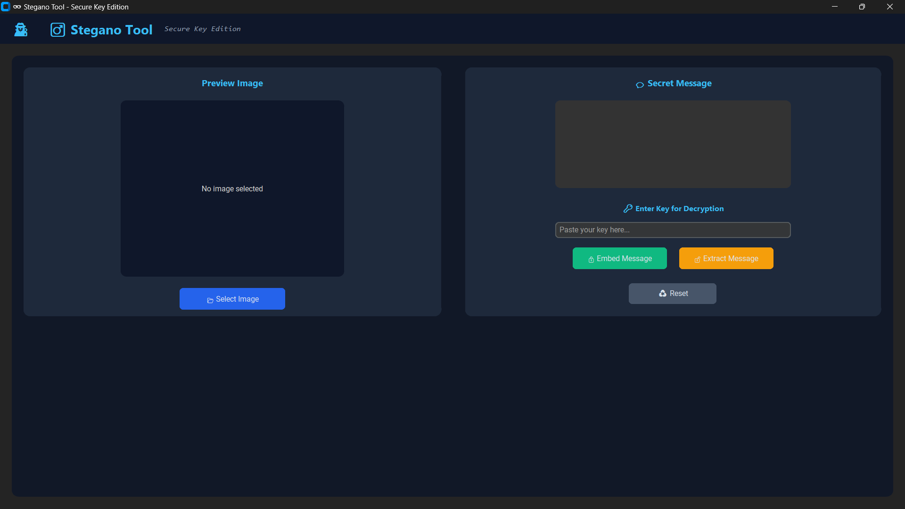
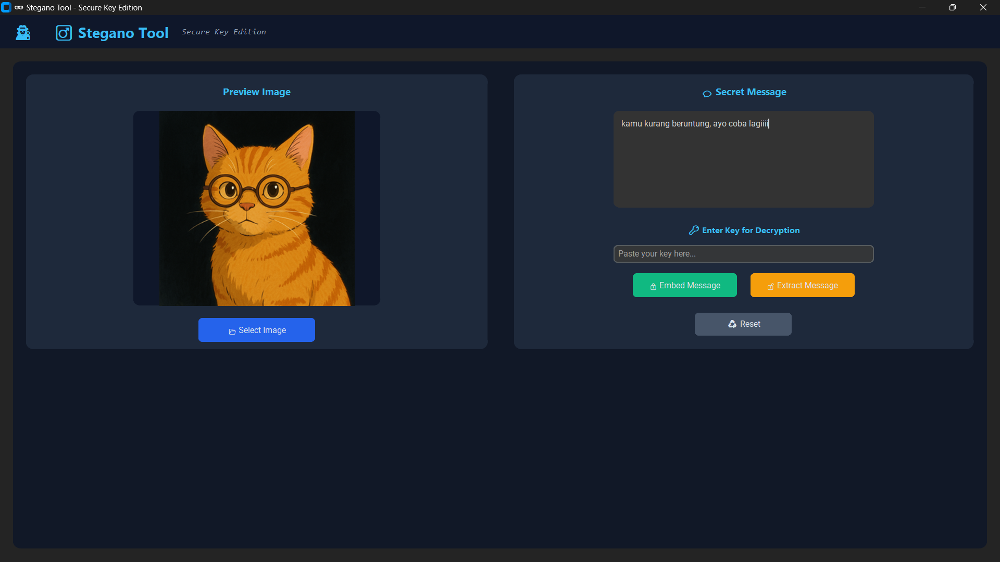
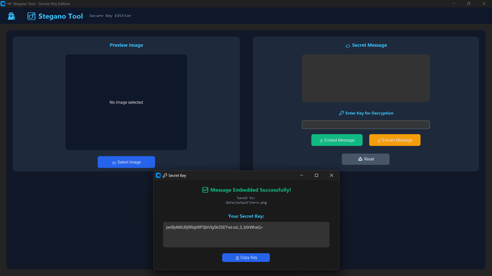

# 🕶️ Stegano Tool - Secure Key Edition

Aplikasi Python dengan GUI modern untuk menyembunyikan dan menampilkan pesan rahasia di dalam gambar menggunakan teknik **steganografi** dan **enkripsi kunci unik (Fernet AES)**.

Setiap gambar punya kunci terenkripsi sendiri, jadi aman dan tidak saling tertukar.

---

## 📂 Struktur Folder

```
stegano-tool/
│
├── src/
│   ├── core/
│   │   ├── __init__.py
│   │   ├── steganography.py       # Logika utama penyembunyian & ekstraksi pesan
│   │   ├── encryption.py          # Enkripsi/dekripsi pesan (AES, dll)
│   │   └── utils.py               # Fungsi bantu seperti konversi biner, validasi, dll
│   │
│   ├── gui/
│   │   ├── __init__.py
│   │   └── app.py                 # GUI utama menggunakan CustomTkinter
│
├── data/
│   ├── input/                     # Gambar sebelum disisipi
│   ├── output/                    # File hasil embedding/extraction
│   └── secret/                    # File key rahasia
│
├── requirements.txt               # Daftar dependency Python
├── README.md                      # Dokumentasi project
```

---

## ⚙️ Instalasi & Menjalankan

1. **Clone repository:**

   ```bash
   git clone https://github.com/username/stegano-tool.git
   cd stegano-tool
   ```

2. **Install dependencies:**

   ```bash
   pip install -r requirements.txt
   ```

3. **Jalankan aplikasi:**

   ```bash
   python -m src.gui.app
   ```

---

## 🖼️ Tampilan Aplikasi

### 1️⃣ Tampilan Awal



### 2️⃣ Setelah Memilih Foto & Memasukkan Pesan Rahasia



### 3️⃣ Pesan Berhasil Disisipkan (Key Ditampilkan)



### 4️⃣ Ekstraksi Pesan Rahasia (Dengan Secret Key)


---

## 💡 Fitur Utama

* 🔒 **Steganografi Aman** — Pesan disembunyikan di dalam gambar tanpa merusak kualitas.
* 🔑 **Kunci Unik per Gambar** — Setiap gambar memiliki key terenkripsi tersendiri.
* 🖥️ **GUI Modern** — Dibangun dengan CustomTkinter bergaya dark mode yang elegan.
* 🧠 **Enkripsi AES (Fernet)** — Menjamin pesan tidak bisa dibaca tanpa kunci yang valid.

---

## 🧑‍💻 Kontribusi

Kontribusi sangat diterima! Silakan buka *pull request* atau laporkan bug di bagian *Issues*.

---

## 📜 Lisensi

Proyek ini dirilis di bawah lisensi **MIT** — bebas digunakan untuk keperluan belajar dan pengembangan pribadi.

---

> Dibuat dengan ❤️ oleh [Alam](https://github.com/kurapika12) — Keep your secrets safe in pixels.
